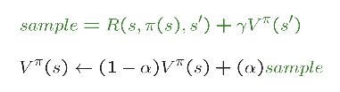
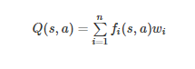
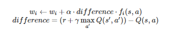

# pacman-reinforcement
- Câu 1:
  - Sử dụng công thức Bellman
    - Hàm computeQValueFromValues: tính Q*
    - Hàm computeActionFromValues: tính V*
    
  
- Câu 2:
  - Cập nhật noise: noise/=2 => Đến khi thành công
- Câu 3:
- Câu 4:
  - Hàm init: values có cấu trúc dữ liệu Counter
  - Hàm getQValue: trả về giá trị của (state, action)
  - Hàm computeValueFromQValues:
    + Nếu không còn action return 0.0
    + Loop trên các action có thể từ state hiện tại
    + Lưu giá trị của từng action
    + Return giá trị max
  - Hàm computeActionFromQValues: Tương tự hàm computeValueFromQValues, tìm ra action có giá trị max 
  - Hàm update:
    + Update value của state, action bằng công thức dưới
    + Nếu kết thúc: không cần + phần discount
    
- Câu 5:
  - Ý tưởng: Lấy r = số random nếu:
    - r < epsilon: lấy random action từ list legalAction (exploration)
    - r >= epsilon:  lấy action tốt nhất (exploitation)
- Câu 6:
- Câu 7:
- Câu 8:
  - Với hàm getQValue:
    + Lấy ra feature vector, loop trên đó tính theo công thức:
    
  - Với hàm update:
    + Tính difference theo công thức dưới
    + Lấy ra feature vector, loop trên đó cập nhật weight:
    
